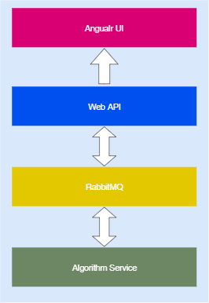
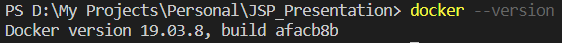
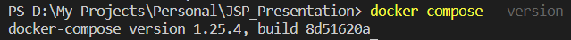

A web demo system to present solving basic Job Shop Schedule Problem by different algorithms or solvers.
It uses a third pard UI component in GPL license to show schedule results([angular-gantt-schedule-timeline-calendar](https://github.com/neuronetio/angular-gantt-schedule-timeline-calendar)), so it must also be in GPL.  

# About this project
It's a personal demo project to display the process and result of solving JSP problem by different representation model or algorithms.I create it out of interest in JSP problem, I was responsible for algorithm module development in a production schedule project before, though I can evaluate one algorithm's or solver's performance by comparing objective score and calculating time, it's hard to watch the whole calculating process intuitively without web UI.So I decide to write a present demo by myself integrated with different algorithms, personally I want to use this demo to learn more about optimization algorithms.
This demo is web system consist of several modules: front-end UI, back-end API, algorithm service and rabbitmq servcie. Front-end is written in Angular, using a third-party gantt chart component to display schedule result; Using .NET Core to deploy API, the main responsibility of back-end API is pushing real time calculating data to Angular UI(SignalR is used); An algorithm service is an independent one, it is written in JAVA (Considering most solvers support Java), it will receive calculate request, handle it and return the calcualted result, both intermediate and final; Between Algorithm service and back-end API, using rabbitmq service to be the communication solution, back-end API puts calculate requests into queue, algorithm service puts calculated results into queue; About deployment, using Docker to set up micro-services, Angualr UI, API, Algorithm service and RabbitMQ service are packed in different containers.

  

# Quickly deploy
I prepared install scripts to build and deploy the whole system from source code, if install successfully, open browser and navigate to http://localhost:9902 , you should see the demo.Because all modules are deployed into containers, Docker and Docker-Compose are prerequisites.
## Install in windows
Make sure you have installed Docker Desktop and Docker-Compose :

  

  

Download the unzip the source code, navigate to 'src' in command line
